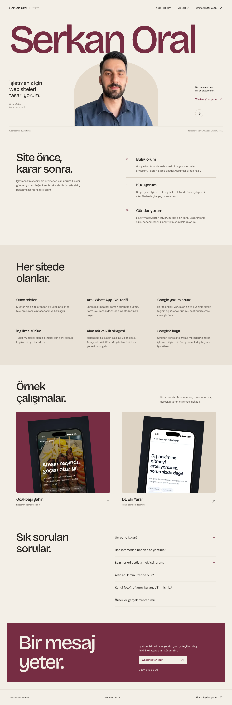
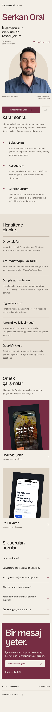
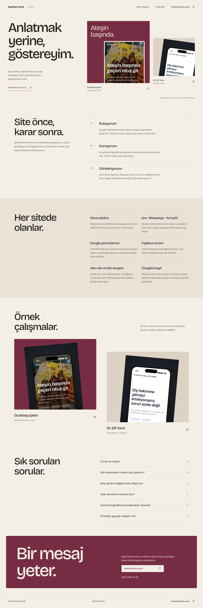
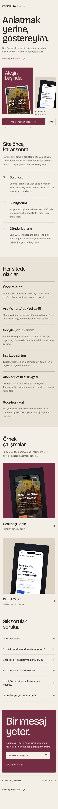
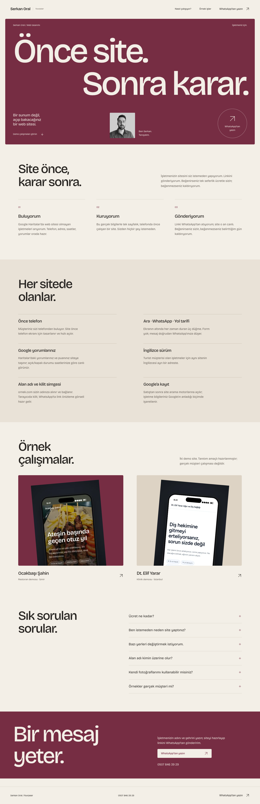
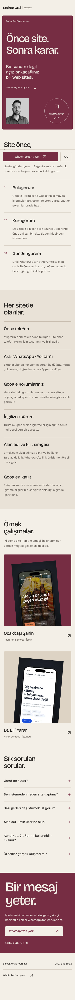

# Tasarım B inceleme kanıtları

Üretim sürümünden 1440×1000 masaüstü ve 390×844 telefon görüntüleri.
Portre `/serkan-oral/b`, Galeri `/serkan-oral/b/galeri`, Afiş `/serkan-oral/b/afis`.

Her sayfa aynı kaynak metinlerle 3 adım, 6 özellik, 2 demo, 6 SSS ve WhatsApp/telefon kapanışı içerir.
Geçiş seçicisi yoktur. Bütün sayfalar noindex’tir.

## Doğrulama

```sh
npm run typecheck && npm run lint && npm run build
npm run start -- --port 3101
node components/serkan-b/verify.mjs
```

`SERKAN_B_BASE_URL` ile kontrol adresi değiştirilebilir. Sistem Chrome gerekir.
Test; bölüm sayıları, çalışan demo yolları, görseller, aynı WhatsApp mesajı,
SSS aç/kapat, klavye skip-link, sabit mobil iletişim ve noindex’i doğrular.
320px azaltılmış hareket ve JavaScript kapalı 390px senaryolarını da çalıştırır.
Sonuçlar `results.json` içindedir. Tam sayfa mobil çekimlerde sabit çubuk,
çekimin ilk görünüm yüksekliğinde yer alır.

| Tasarım | Masaüstü | Telefon |
| --- | --- | --- |
| Portre |  |  |
| Galeri |  |  |
| Afiş |  |  |
